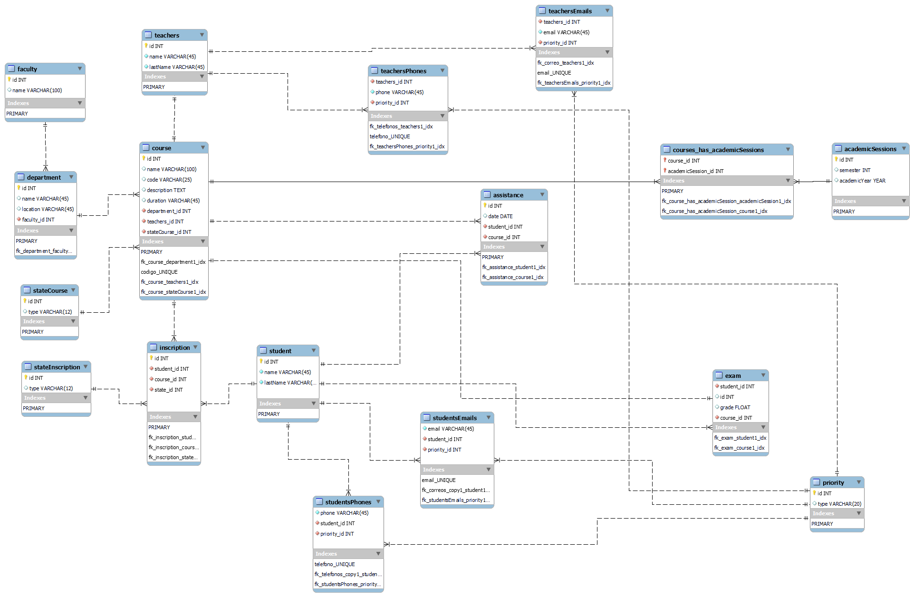

# UNIVERSITY DATABASE


## CONCEPTUAL MODEL

- A school/university has different departments that offer courses to students in a specific academic session.
- Each of these courses is taught by a teacher.
- Students can enroll in different courses in an academic session.
- In addition to registration details, the university/school must also maintain basic information about the student.
- The department keeps track of student attendance, which determines whether a student is eligible for exams in that academic session or not.
- Exams are conducted for each academic session, and the results are shared with the students within a specified time frame.
- The department also maintains a record of the faculty's login and logout times for reporting purposes.

## PHYSICAL MODEL



## TABLE DESCRIPTIONS

### Faculty

- `id`: Integer, not null, primary key
- `name`: Varchar(100), not null

### Department

- `id`: Integer, not null, primary key
- `name`: Varchar(45), not null
- `location`: Varchar(45), not null
- `faculty_id`: Integer, not null, foreign key references faculty(id)

### StateCourse

- `id`: Integer, not null, primary key
- `type`: Varchar(12), not null

### StateInscription

- `id`: Integer, not null, primary key
- `type`: Varchar(12), not null

### Priority

- `id`: Integer, not null, primary key
- `type`: Varchar(20), not null

### AcademicSessions

- `id`: Integer, not null, primary key
- `semester`: Integer
- `academicYear`: Year, not null

### Teachers

- `id`: Integer, not null, primary key
- `name`: Varchar(45), not null
- `lastName`: Varchar(45), not null

### TeachersPhones

- `teachers_id`: Integer, not null, foreign key references teachers(id)
- `phone`: Varchar(45), not null, primary key
- `priority_id`: Integer, not null, foreign key references priority(id)

### TeachersEmails

- `teachers_id`: Integer, not null, foreign key references teachers(id)
- `email`: Varchar(45), not null, primary key
- `priority_id`: Integer, not null, foreign key references priority(id)

### Students

- `id`: Integer, not null, primary key
- `name`: Varchar(45), not null
- `lastName`: Varchar(45), not null

### StudentsPhones

- `phone`: Varchar(45), not null, primary key
- `student_id`: Integer, not null, foreign key references students(id)
- `priority_id`: Integer, not null, foreign key references priority(id)

### StudentsEmails

- `email`: Varchar(45), not null, primary key
- `student_id`: Integer, not null, foreign key references students(id)
- `priority_id`: Integer, not null, foreign key references priority(id)

### Course

- `id`: Integer, not null, primary key
- `name`: Varchar(100), not null
- `code`: Varchar(25), not null
- `description`: Text
- `duration`: Varchar(45)
- `department_id`: Integer, not null, foreign key references department(id)
- `teachers_id`: Integer, not null, foreign key references teachers(id)
- `stateCourse_id`: Integer, not null, foreign key references stateCourse(id)

### AcademicSessions_has_courses

- `academicSession_id`: Integer, not null, foreign key references academicSessions(id)
- `course_id`: Integer, not null, foreign key references course(id), primary key

### Exam

- `student_id`: Integer, not null, foreign key references students(id)
- `id`: Integer, not null, primary key
- `grade`: Float
- `course_id`: Integer, not null, foreign key references course(id)

### Inscription

- `id`: Integer, not null, primary key
- `student_id`: Integer, not null, foreign key references students(id)
- `course_id`: Integer, not null, foreign key references course(id)
- `state_id`: Integer, not null, foreign key references stateInscription(id)

### Assistance

- `id`: Integer, not null, primary key
- `date`: Date, not null
- `student_id`: Integer, not null, foreign key references students(id)
- `course_id`: Integer, not null, foreign key references course(id)

## USAGE INSTRUCTIONS

### 1. Connect to the Database Server

Open a command line client or a graphical interface that allows you to connect to your MySQL or MariaDB database server.

`mysql -u your_user -p`

Replace `your_user` with your database username.

### 2. Create the Database

`CREATE DATABASE your_database_name;`

Replace `your_database_name` with the desired name for your database.

### 3. Select the Database

`USE your_database_name;`

This will allow you to execute commands within that database.

### Run the SQL Script

You can copy the script content inside the `.sql` file and paste it into your console to execute it.

## QUERIES FOR THE DATABASE

## Faculty table queries

*--Know all faculties*

```sql
SELECT * FROM faculty;
```

*--Know the number of faculties*

```sql
SELECT COUNT(*) as facultyCount FROM faculty;
```

## Department table queries

*--Know the departments located in the central building*

```sql
SELECT * FROM department WHERE location = 'Central Building';
```

*-- Know the departments and their respective faculty*

```sql
SELECT d.name department, f.name faculty FROM 

department d

INNER JOIN faculty f ON d.faculty_id = f.id;
```

## StateInscription table queries

*--Know the states of inscription*

```sql
SELECT * FROM stateInscription;
```

*--Know inscriptions with active status through join showing student name, course name, and status*

```sql
SELECT s.name student, c.name course, si.type FROM

stateInscription si

INNER JOIN stateCourse sc ON si.id = sc.id

INNER JOIN course c ON sc.id = c.id

INNER JOIN students s ON c.id = s.id;
```

## StateCourse table queries

*-- Know the states of the courses*

```sql
SELECT * FROM stateCourse;
```

*-- Show the courses and their states*

```sql
SELECT c.name, sc.type AS state

FROM stateCourse sc

JOIN course c ON c.stateCourse_id = sc.id;
```

## Inscription table queries

*-- Count the number of inscriptions*

```sql
SELECT COUNT(*) as totalInscriptions FROM inscription;
```

*-- Count the number of active inscriptions*

```sql
SELECT COUNT(*) as activeInscriptions FROM inscription

WHERE state_id = 1;
```

## Course table queries

*-- Show the courses that are in active state*

```sql
SELECT c.name,c.code,c.description,c.duration, sc.type as state

FROM course c

JOIN stateCourse sc ON sc.id = c.stateCourse_id

WHERE sc.type = Active; 
```

*-- Show the courses that have a duration of 12 months and are active*

```sql
SELECT c.name,c.code,c.description,c.duration, sc.type as state

FROM course c

JOIN stateCourse sc ON sc.id = c.stateCourse_id

WHERE duration = 12;
```

*-- Query all courses*

```sql
SELECT * FROM course;
```

## Teachers table queries

*-- Show all teachers*

```sql
SELECT * FROM teachers;
```

*-- Show all teachers with their emails and phone numbers*

```sql
SELECT t.*, tp.phone, te.emails

FROM teachers t 

JOIN teachersEmails te ON t.id = te.teacher_id

JOIN teachersPhones tp ON t.id = tp.teacher_id;
```

## Students table queries

*-- Show all students with their emails and phone numbers*

```sql
SELECT s.*, sp.phone, se.email

FROM students s 

JOIN studentsEmails se ON s.id = se.student_id

JOIN studentsPhones sp ON s.id = sp.student_id;
```

*-- Show all students with an 'a' in their name*

```sql
SELECT * FROM students

WHERE name LIKE '%a%';
```

## Exam table queries

*-- Query the name and grade of students in the course with id = 3*

```sql
SELECT students.name, exam.grade

FROM students

JOIN exam ON students.id = exam.student_id

WHERE exam.course_id = 3;
```

*-- Query grades greater than 80*

```sql
SELECT students.name, exam.grade

FROM students

JOIN exam ON students.id = exam.student_id

WHERE exam.grade > 80;
```

## Assistance table queries

*-- Query all assistance records*

```sql
SELECT * FROM assistance;
```

*-- Query assistance records of students in the course with id=5*

```sql
SELECT students.name, assistance.date

FROM students

JOIN assistance ON students.id = assistance.student_id

WHERE assistance.course_id = 5;
```

## Priority table queries

*-- Query all priorities*

```sql
SELECT * FROM priority;
```

*-- Show all student phones with priority id = 1*

```sql
SELECT s.name, sp.phone, p.type

FROM studentsPhones sp

JOIN priority p ON sp.priority_id = p.id

JOIN students s ON sp.student_id = s.id

WHERE sp.priority_id = 1;
```

## AcademicSessions table queries

*-- Show academic sessions and associated courses*

```sql
SELECT academicSessions.*, course.*
FROM academicSessions_has_courses
INNER JOIN academicSessions ON academicSessions.id = academicSessions_has_courses.academicSession_id
INNER JOIN course ON course.id = academicSessions_has_courses.course_id;
```

